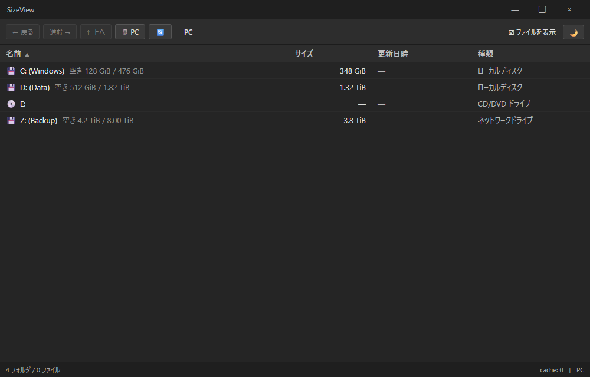
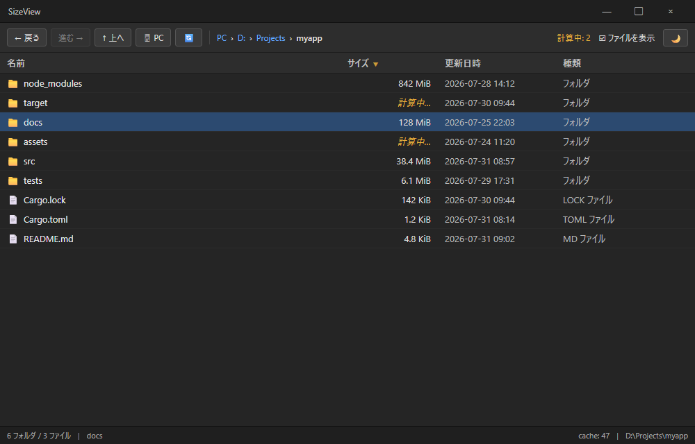
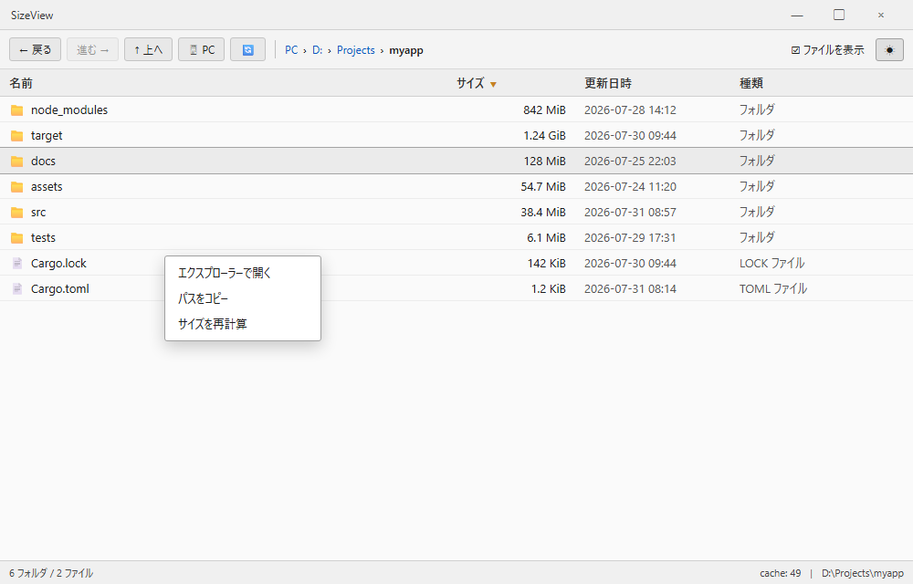

# SizeView

Windows エクスプローラー風の詳細表示で、**フォルダのサイズも一覧できる**軽量ビューア。
エクスプローラーは標準ではフォルダサイズを出してくれないため、ざっくり「どこが重いか」を把握したい時に使う。

- サイズは裏でスレッド並列に計算し、UI は止まらない
- 計算済みサイズはローカル キャッシュ (mtime 検証) に保存、次回起動で即時表示
- 列見出しクリックで名前 / サイズ / 更新日時 / 種類 でソート
- ダーク / ライト / OS 追従の 3 テーマ、Windows タイトルバーも追従

## スクリーンショット

### 起動時: ドライブ一覧



- 起動直後は必ずドライブ一覧 (「PC」相当)
- 各ドライブに空き容量 / 総容量が併記される
- CD/DVD・ネットワークドライブなど遅いメディアには問い合わせないので即座に表示

### フォルダを開いた状態



- ドライブまたはフォルダをダブルクリック / Enter で入る
- 計算中のフォルダは「計算中…」表示、完了次第置き換わる
- 右上に未計算件数、下部ステータスバーに合計とパス
- 列見出しをクリックでソート方向切替

### 右クリック メニュー (Light テーマ)



- 行を右クリックで **エクスプローラーで開く / パスをコピー / サイズを再計算** (キャッシュ破棄して再スキャン)
- 上図は Light テーマの状態。右上の 🌙 / ☀ ボタンから「OS に従う / ダーク / ライト」を切替可能

## 動作要件

- Windows 10 以降 (64 bit)
- テーマ検出 (OS 追従) は Windows のみ

## ビルド

```bash
cargo build            # debug
cargo build --release  # release
```

生成物は `target/debug/sizeview.exe` または `target/release/sizeview.exe`。

## 操作

### マウス

| 操作 | 動作 |
|------|------|
| 行をクリック | 選択 |
| 行をダブルクリック | フォルダなら入る |
| 行を右クリック | コンテキストメニュー |
| 列見出しクリック | その列でソート、再クリックで昇/降切替 |
| パンくずのリンク | 途中のフォルダに一発ジャンプ |

### キーボード

| キー | 動作 |
|------|------|
| ↑ / ↓ | 選択行移動 |
| Home / End | 先頭 / 末尾へ |
| Enter | 選択フォルダに入る |
| Backspace | 親フォルダへ |
| F5 | 現在の一覧を再計算 (キャッシュ破棄) |
| Alt + ← / → | 履歴の 戻る / 進む |

## データ保存場所

| 種別 | 場所 |
|------|------|
| 設定 (テーマ・ソート・ウィンドウサイズ 等) | `%APPDATA%\sizeview\config.json` |
| サイズ キャッシュ | `%LOCALAPPDATA%\sizeview\cache.json` |

いずれも書き込みは tmp → rename の atomic write。書き込み中クラッシュしても既存ファイルは壊れない。
キャッシュはソフト上限 100,000 エントリ、超過時は一部を任意順で破棄する。

## 既知の制限

- キャッシュ検証は NTFS のフォルダ mtime を利用する。**深い階層のファイル書き換えは反映されない**ため、正確に取り直したい場合は右クリック「再計算」または F5 を使う。
- リパースポイント (シンボリックリンク・ジャンクション) はサイズ計算をスキップ (無限ループ防止)。
- OS のテーマを実行中に切り替えた場合、SizeView 内での自動追従はしない (再起動で反映)。
